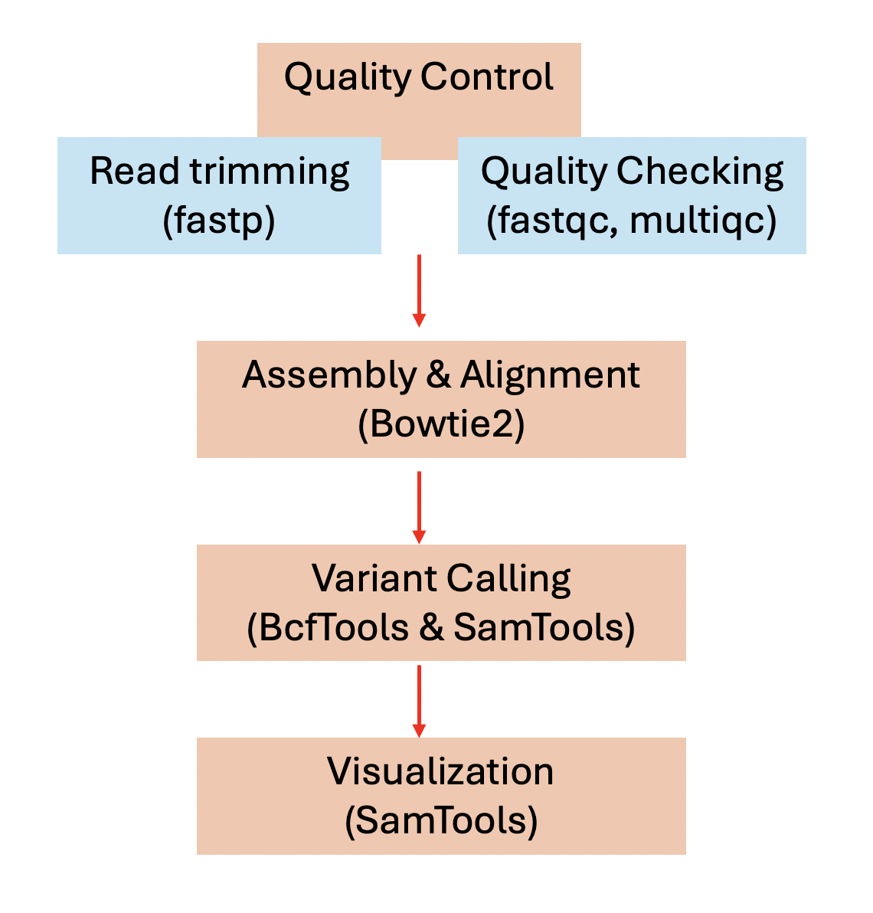
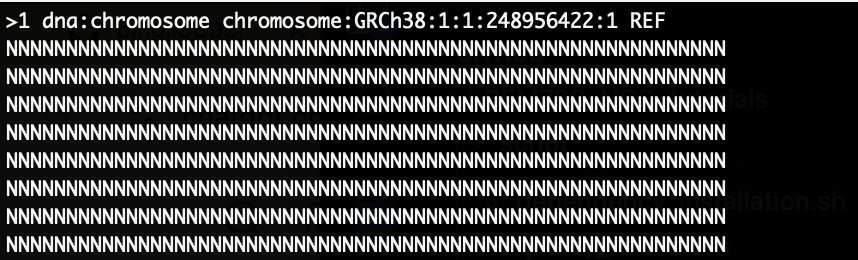
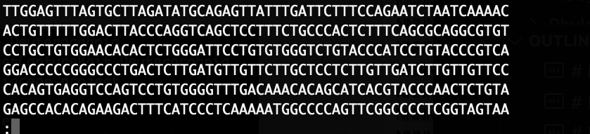

# BEM 780 Class Project: Basic pipelines for variant calling 

# Introduction: 
Next-generation sequencing (NGS) is a high-throughput technology that allows for the parallel sequencing of millions of DNA or RNA fragments, providing comprehensive insights into genetic material. Data generated from NGS can go through many different pipeline to extract useful information. Among all potential pipelines, variant calling is a key bioinformatics process that identifies genetic variations, such as single nucleotide polymorphisms (SNPs), insertions, and deletions, by comparing DNA sequencing data to a reference genome. These genetic variations are fundamental to understanding how genomes differ within and between populations, influencing traits, diseases, and evolutionary processes. By pinpointing these variations, researchers can explore genetic diversity, uncover disease mechanisms, and guide advancements in precision medicine, agriculture, and conservation.

This technique is widely used in fields like human genomics, cancer research, and evolutionary biology. For instance, it aids in linking genetic variants to traits in genome-wide association studies (GWAS), identifying mutations in cancer for targeted treatments, and tracking genetic changes in pathogens. Despite its importance, variant calling can be challenging due to factors like sequencing quality and computational complexity, making it essential to apply rigorous quality control and validation. Ultimately, variant calling serves as a cornerstone for genomic research, unlocking insights into the genetic basis of biological diversity and disease.

This tutorial provides a basically pipeline to analyze NGS data from raw sequencing reads to visualization of variant calling, be integrating a reference genome. The scripts developed for this tutorial could be applied to other dataset besides the example data. A basic variant calling which contains the following steps: 1. Quality Control; 2. Assembly and Alignment; 3. variant calling. 4. Downstream analysis, which is shown in the figure below:  



This tutorial will start with raw sequencing data and discusses each of the step above. For downstream analysis, it depends on the real research question so this tutorial will only present how to visualize the variant calling results. 

# Basic overview: 
What are the goals of the tutorial? 
1) This repository (repo) decouments a very basic pipeline for NGS analysis from quality control to variant calling. 

2) This pipeline assumes that the users have no experience in NGS analysis but have some basic knowledge in Linux/Bash and Git. 

3) The tutorial contains several parts: 
    1. How to get started: *This section discussed basic prompts and structure of the repository and anything the user needs to know before using the tutorial*
    2. Software installation: *This step walked through how to install the softwares.* 
    3. Description of the example data: *This part presents two datasest (simulated and real human datasets) to be used.* 
    4. Variant calling pipeline: *After all the preparation work, section 4 presents how variant calling pipeline is conducted*
        4.1 Quality control: 
        4.2 Assembly and Alignment 
        4.3 Visualize variant calling results 
    5. Conclusion     
    6. References 

# Section 1 - How to get started? 

### Basic prompt overview: 
*You should skip this part if you know basic git and command line prompt*
To start this tutorial, let's discuss some very basic command line prompts used in this tutorial.
```
pwd # -- print the path for the current directory 
cd # -- change to a directory. Here, "./" is the current directory, and "../" is the directory above. 
mkdir # -- create a directory
chmod +x # -- change a binary file to a executable file
```
This tutorial also utilizes Git/GitHub, and here are useful information for basic git command: https://github.com/joshnh/Git-Commands. If git is not pre-installed, visit this website: https://github.com/git-guides/install-git 

### Get started and download this Github Repo
Ready? Now, let's officially start the tutorial! First, the below code in Linux/Terminal, which will download all the codes and example files to be used into the local directory you chose: 
```
git clone https://github.com/bingli8899/BEM780_NGS_tutorials.git
cd BEM780_NGS_tutorials # This is our $ROOT directory 
```

While you are checking the downloaded repo, let's discuss the basic structure of this repo! 
### Repo structure: 
The tutorial was designed as a github repo, where all scripts will be stored in $ROOT/script/ and example data set will be stored in $ROOT/example. $ROOT is the top directory of this repo. *It is noted that all codes are designed to be run in the $ROOT directory.* Below shows the structure of this repo from $ROOT: 

- **[script/](script/)**  
  Contains all scripts necessary for running the workflow:  
  - [alignment_variant_calling.sh](script/alignment_variant_calling.sh)  
    Main script for alignment and variant calling.  
  - [check_command.sh](script/check_command.sh)  
    Utility script to verify if required commands is installed.  
  - [quality_control.sh](script/quality_control.sh)  
    Script for performing quality control on input data.  
  - [software_installation.sh](script/software_installation.sh)  
    Script for installing required software.

- **[example/](example/)**  
  Contains example files and data for testing and simulation:  
  - **simulated_data/**  
    Example input files, including:  
    - `A.fasta`, `B.fasta`, ... `E.fasta`  
    - `reference.fasta`  
  - **simulation/**  
    Files and scripts for running simulations:  
    - `configuration.txt` (example/simulation/configuration.txt) 
    - `simulation_seqs.sh` (example/simulation/simulation_seqs.sh) 
- **[figures/](igures/)**
  Contains all figures used in this tutorial. All figures are made for this tutorial and no citation is needed. 

### How to run a script: 
To execute a script, provide the necessary user-defined arguments to generate the desired output. In this tutorial's scripts, I wrote the script so that you can specify parameters such as the number of threads (CPUs), input directory, and output directory. These scripts will then automatically perform the analysis based on your inputs. Throughout this guide, placeholders like <argument> indicate where you should insert your specific values.

Example:

```
# Usage: quality_control.sh <input_directory> <number_of_threads> <output_directory>
```
Replace <input_directory>, <number_of_threads>, and <output_directory> with your actual input directory path, desired number of CPU threads, and output directory path, respectively (see examples in this tutorial). These scripts are designed to process any datasets, not just the example data provided. Therefore, by specifying your own input and output directories, you can apply the analysis to your research data.

Note: Ensure that the specified input directory contains the appropriate data files required for the analysis.

# Section 2: Software installation: 
Surprisingly, installing software is often one of the most challenging steps of working with NGS data. Errors from configuration issues and version incompatibilities between dependencies can be overwhelming. This tutorial provides *two methods* for software installation. 

The first method involves using Conda, which is open-source, cross-platform package and environment management tool that simplifies the installation and management of software packages and their dependencies. The second method demonstrates how to install software from source code, which involves manually compiling the program's code on your system.

For first-time or beginner Linux users, I highly recommend starting with Method 1 (Conda), as it simplifies dependency and package management. If this approach fails, you can then proceed to Method 2, which involves installing the software directly from source code.

### Method 1: Use Conda 
I intentionally chose all softwares that could be easily installed through conda (Instruction here: https://docs.conda.io/projects/conda/en/latest/user-guide/install/index.html). 

To get started, the below code creates a conda environment named "snp_tutorial", which is an isolated environment that has a specific collection of packages and their dependencies, allowing you to manage multiple projects with distinct requirements on the same system. 

Run the code to create and activate the conda enviroments: 
```
conda create -n "snp_tutorial" 
conda activate snp_tutorial 
```
PS: 1. You might need to type in "Y" to proceed with running the above code. 2. Make sure to deactivate the conda environment after you are done with this tutorial. 3. Makre sure you re-active the environment if you want to resume back to your previous work. 

Then, run the following codes to install necessary softwares. In real reseach, it would be better to keep a good record of how you downloaded the softwares and the software versions. Most of the conda-installed softwares are NOT the most recent version.  
```
conda install bioconda::samtools
conda install bowtie2
conda install bioconda::bcftools
conda install bioconda::fastqc 
conda install bioconda::multiqc  
conda install bioconda::fastp
conda install bioconda::sra-tools 
conda install bioconda::seqtk
```
Note: You might need to type in "Y" to proceed with running the above code. 

Here, I mainly used the softwares: 
    1. Process sequencing reads and transitioning between file types: samtools (https://github.com/samtools/samtools; Danecek et al. 2021)
    2. Aligning sequencing with the reference: bowtie2 (https://github.com/BenLangmead/bowtie2; Langmead et al. 2012)  
    3. Variant calling and transitioning between file types: bcftools (https://github.com/samtools/bcftools; Danecek et al. 2021)
    4. Quality control for raw reads: fastp (https://github.com/OpenGene/fastp; Chen et al. 2018) 
    5. Check the results from quality control: multiqc (https://github.com/MultiQC/MultiQC) and fastqc (https://github.com/s-andrews/FastQC)
    6. Download data from SRA: sra-tools (https://github.com/ncbi/sra-tools)
    7. Utility usage for format transitioning: seqtk (https://github.com/lh3/seqtk)

If any of those download failed, I would suggest to trouble shoot through conda or install with source codes (see below). 

### Method 2: Use Source codes 
If conda doesn't work for any reasons, softwares could always be installed through source codes. To explain the basic workflow, create a executables folder ($ROOT/executables) first and later we will move all binary executables we need in this folder. Then, download all essemtial softwares and move the binary executables into the executables file. 

If conda failed and softwares need to installed through source codes, I would recommend to check dependencies first. Run the below script to check if all dependencies are installed: 

```
# Usage: check_command.sh <command>
chmod +x script/check_command.sh # This could be skipped depending on the system 
script/check_command.sh gcc
script/check_command.sh cmake
```
This last command would generate "cmake is installed. Version: cmake version 3.30.5" in my Mac. This tells you the command got installed and which versions it is. 

If the command is not installed, then it will print out and warn the user to install the command. 
```
script/check_command.sh FakeCommand
# Print out: FakeCommand is not installed. 
```
The user should check the dependencies installed in their system first and then proceed to install softwares.  

To install the actual software, I presented part of my method to download through source dependencies in $ROOT/script/software_installation.sh. It is noted that I tested this code in a online server with Linux system. Depending on the system, the codes (./script/software_installation.sh) may need to be modified. If there is any problem of running the code, I would suggest to run separate chunks of codes as separated by the ### in either script to figure out the issues. 

# Section 3: Description of the example data 
This tutorial worked through real human data to represent the pipeline. It also utilized some simulated data to test codes, because simulated dataset are smaller and could be run quickly. The description of the simulated dataset and its corresponding dataset are presented in **[example/simulated_data](example/simulated_data/)**. Details about this simulated dataset will not be presented along this tutorial. 

### Let's download the example data from SRA 
Sequence Read Archive (SRA) data, available through multiple cloud providers and NCBI servers, is the largest publicly available repository for raw sequencing data. A commonly used method to download from SRA is to use SRAtools (https://github.com/ncbi/sra-tools/wiki/01.-Downloading-SRA-Toolkit). In the above section, we downloaded through conda. If the conda downloaded version doesn't work, I would suggest to download the newest version from source code. 

Let's work on some real human data as well. The below steps show how to download read human data from online resouces: 

Download the reference: 
```
mkdir -p example/human_data && cd example/human_data
wget ftp://ftp.ensembl.org/pub/release-113/fasta/homo_sapiens/dna/Homo_sapiens.GRCh38.dna.primary_assembly.fa.gz
gunzip Homo*
ls ./ 
# This should print out Homo_sapiens.GRCh38.dna.primary_assembly.fa 
```
This downaloded and unzipped a humen genome in $example/human_data/, which will be used as the refernece genome for variant calling. This is often refered as the Genome Reference Consortium Human Build 38 (hg38), which is the primary assembly including the complete sequence of human chromosomes and often used as a reference for human genomic study. 

Then, let's download some raw reads:

``` 
prefetch SRR098401
fastq-dump --split-files --gzip SRR098401ra
```
The above code downloads and transfer the .sra files to fastq or fastq.gz and generated two fastq.gz files, SRR098401_1.fastq.gz (forward-end sequencing) and  SRR098401_2.fastq.gz (reverse-end sequencing) for pair-end reads. If "prefetch" command line failed, I would suggest to manually download the data here: https://trace.ncbi.nlm.nih.gov/Traces/?view=run_browser&acc=SRR098401&display=metadata or potentially re-install the newest version of SRAtools through sourcecode (check the tutorial here **[script/software_installation.sh](script/software_installation.sh)**). 

This downloaded data file is the raw sequencing data from the whole exome sequencing for the 1000 genomes project (project description: https://www.ncbi.nlm.nih.gov/bioproject/PRJNA59853). It contains exome sequencing of (CEU) Utah residents with ancestry from Northern and Western Europe. 

The above code might be slow. If that's the case, run the below code after "prefetch" to only extract 100000 bases, which could largely speed up the whole process. 
```
fastq-dump --split-files --gzip -N 1 -X 100000 SRR098401ra
cd ../../ 
```
The example data are now downloaded in $ROOT/example/human_data

### What are some typical formats of raw sequencing data? 
Sequencing raw reads are typically stored in fastq (fq, fq.gz). Later, such files are processed and potentially transferred to fasta files (.fa, .fa.gz). The difference between .fasta file and .fastq file is that fasta files only contain the nucleotide or protein sequences, while fastq files contain more sequencing information such as quality score. For paried-read read sequences, each sample has two files .R1 (forward-end sequencing) and .R2 (reverse-end sequencing). 

Let's zoom in closely to the data files we downloaded. 

##### Let's look at the fasta/fa/fa.gz files first! 
```
less example/human_data/Homo_sapiens.GRCh38.dna.primary_assembly.fa 
```
This will generated the below text view. The "N" here means that there is a missing base. Starting with ">", the header tells us this is a chromosome from GRCh38, which is our primary genome assembly. Clearly, for the beginning of this chromosome, there are a lot of missing bases.  



Type "g" and then type in "10000". This will bring to the 10000 position of the file. This shows the actual bases along the chromosome. Type "q" to exit this view. 

 

This is a typical *fasta* files, which contains the header of the sequence and the actual bases. Missing values are typically shown by "-", "?" or "N". 

##### Let's look at the fastq/fq/fastq.gz files! 

Again, let's view the downloaded file. 
```
less example/human_data/SRR098401_1.fastq.gz  
```
The beginning of this file still contains a lots of missing "N", which is very common for sequencing data. Type in "g" and the type in 100000, and you will find the below view: 

 

Clearly, the fastq files look very different than fastq file. Not only it contains the actuall seuqnce. It contains the name of the sample (SRR098401), a unique sequence ID followed after the sample name (25006), metadata (8099ABXX101220:5:1:17260:3096), and the length of the read (length = 76). The actual sequence is samed as the next line. After that, the line with "+" is simply a separator between the nucleotide sequence and the quality scores. The line after the separator shows the quality score, which tells the confidence of the sequencing. 

Quality control softwares utilized the information in the sequencing and the quality score of fastq.gz and fastq files, to determine which parts or reads should be trimmed. In the below section, we will dive into how to do quality control. 

# Section 4 
### 4.1 Quality control 
The first step of most NGS pipeline is quality control. There are several tools for quality control, including Fastp, Trimommatics, etc. This step trims low-quality reads, removes short reads, removes adaptor sequences, etc. 

After read trimming, a check procedure using tools such as FastQC and MultiQC is recommended to double check if the trimmed reads have any issues. FastQC could check the quality of individual sequencing files, while MultiQC could aggregate the quality from multiple FastQC results. 

In $ROOT/script/quality_control.sh, the pipeline of using fastp, fastqc and multiqc is integrated. Here, because the real human data is in fastq.gz files, I will run quality control on $ROOT/script/human_data/*.fastq.gz. 

```
# Usage: quality_control.sh <input directory> <number of threads> <output directory>
chmod +x script/quality_control.sh 
script/quality_control.sh example/human_data 3 /example/human_cleaned
```
The above code should output "Oyay! Outputs are in ./human_results.", which means that the code is successfully run. The first argument in quality_control.sh takes the input directory which stores the *.fastq.gz or *.fastq files. The second argument takes the number of threads to be used. In the above code, I used 3 CPUs to run the script. If not sure how many CPUs to be used, please use the below code to use the maximum number of CPUs available in the system: 

```
num_threads=$(nproc --all) 
quality_control.sh example/human_data $num_threads /example/human_cleaned
```
The third argument specifies the output directory. This above code will generate a $ROOT/example/human_cleaned directory and stores all the results, including the cleaned reads and the statistics from quality control. 

Now, in the output directory $ROOT/example/human_cleaned, there are three output directories. $ROOT/example/human_cleaned/cleaned contain the cleaned reads trimmed from fastp. $ROOT/example/human_cleaned/fastqc and $ROOT/example/human_cleaned/multiqc stored the results of quality control files. 

It is highly recommended to check the *.html results from  $ROOT/human_results/fastqc and $ROOT/human_results/multiqc. Details about how to check the results from fastqc and multiqc are attached here: https://hbctraining.github.io/Intro-to-rnaseq-hpc-salmon/lessons/qc_fastqc_assessment.html. 

### 4.2 Assembly and Alignment 
There are many pipelines and methods to assemble genomes, and I will present a commonly used method, which used BcfTools , SamTools and Bowtie to assemble and align the genomes. First, assembly could be classified into three ways: 1. De-novo; 2. Reference-based method, 3. A mixture of de-novo and reference based method. 

I will present the most common method, reference-based method, to call variants. The first step is to map the reads to a reference genome with Bowtie2. Bowtie2 maps the sequencing reads to a reference genome, which in general is composed of two steps: 1. create a bowtie index based on reference genome (bowtie2-build); 2. align reads to reference (bowtie2 -x). Bowtie2 generates alignment file (*.sam)containing the information about where to map the reads to a reference. Details of the code are in the comments of $ROOT/script/alignment_variant_calling.sh. 

### 4.3 Variant Calling
For NGS pipeline, converting between file formats is an essential step, and SamTools is useful to transfering between file formats and conduct a series of bioinformatic applications. To conduct variant calling, SamTools will be used to convert the output from Bowtie2 (*.sam) to *.bam files, which will be input to BcfTools for variant calling. 

Below I wrote the alignment and variant calling into one major scipts $ROOT/script/alignment_variant_calling.sh. Running the below script can conduct alignment and variant calling at the same time. The script contains comment to explain each step. 

Usage of the major script: 
```
# Usage: alignment_variant_calling.sh <input_fasta_directory> <input_reference_file> <number of threads> <path to the output directory>
chmod +x ./script/alignment_variant_calling.sh
./script/alignment_variant_calling.sh example/human_data/ example/human_data/Homo_sapiens.GRCh38.dna.primary_assembly.fa 4 ./results_human_variant_calling
```
The above code generates a output directort in $ROOT or the current directory, which contain the bowtie2 index files (*.bt2.tmp), alignment output (human_data.bam), sorted BAM files (human_data_sorted.bam), BAM index file (human_data_sorted.bam.bai). The sorted bam files could be used to visualize the results from variant calling. 

### 4.4 Visualize variant calling results: 
After variant calling, it would be good to visualize the results first. There are many ways to visualize the results from SNP calling. Let's use a text-based tool (samtool tview) to visualize the results. 

```
samtools tview ./results_human_variant_calling/human_data_sorted.bam ./example/human_data/Homo_sapiens.GRCh38.dna.primary_assembly.fa
```
The above code will give a text view to view the actual results from variant calling. Type "g" could jump to anywher in the alignment to view the results. 

# Section 5 - Conclusion 
This tutorial provided a step-by-step guide for conducting a basic variant calling pipeline using next-generation sequencing (NGS) data. Starting from raw sequencing reads, we demonstrated how to perform quality control, genome assembly, alignment, and variant calling, followed by visualization of results. For beginners in bioinformatics, the repository offers a practical introduction to essential concepts, tools, and workflows. By following this guide, users can use automated scripts that can be adapted to their specific research needs while learning the fundamentals of NGS data analysis. 

Ultimately, this pipeline serves as a foundational framework for variant calling, which is a crucial process for understanding genetic variations and their implications in research fields such as precision medicine, evolutionary biology, and genomics. As NGS technologies continue to advance, mastering these workflows empowers researchers to analyze and extract meaningful insights from large-scale sequencing datasets.

For further exploration, users are encouraged to experiment with the provided example data, modify the scripts, and explore downstream analyses tailored to their specific research questions.

# Reference:
Andrew Rambaut, Nicholas C. Grass, Seq-Gen: an application for the Monte Carlo simulation of DNA sequence evolution along phylogenetic trees, Bioinformatics, Volume 13, Issue 3, June 1997, Pages 235–238, https://doi.org/10.1093/bioinformatics/13.3.235

Shifu Chen, Yanqing Zhou, Yaru Chen, Jia Gu; fastp: an ultra-fast all-in-one FASTQ preprocessor, Bioinformatics, Volume 34, Issue 17, 1 September 2018, Pages i884–i890, https://doi.org/10.1093/bioinformatics/bty560

Petr Danecek, James K Bonfield, Jennifer Liddle, John Marshall, Valeriu Ohan, Martin O Pollard, Andrew Whitwham, Thomas Keane, Shane A McCarthy, Robert M Davies, Heng Li
GigaScience, Volume 10, Issue 2, February 2021, giab008, https://doi.org/10.1093/gigascience/giab008

Diego Mallo, Leonardo De Oliveira Martins, David Posada, SimPhy : Phylogenomic Simulation of Gene, Locus, and Species Trees , Systematic Biology, Volume 65, Issue 2, March 2016, Pages 334–344, https://doi.org/10.1093/sysbio/syv082

Langmead, B., Salzberg, S. Fast gapped-read alignment with Bowtie 2. Nat Methods 9, 357–359 (2012). https://doi.org/10.1038/nmeth.1923


